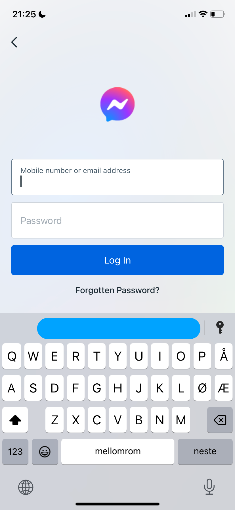

# Messenger Clone

This is the source code for my Messenger Clone application. The app is built

# Screenshots

## Comparison:

| Messenger                                                 | Messenger clone                                         |
|-----------------------------------------------------------|---------------------------------------------------------|
|                |         |
|      |    |
|  |   |
|          |      |
|                    |           |
|          |      |
|            |       |
|  |  |
|  |  |
|                  |          |

> **_NOTE:_**  The screenshots are from this year, but Meta have updated their
> UI recently.

## Full flow:

