# Messenger clone iOS 14+

This is the source code for the Messenger clone application. The app demonstrates how you can build the core functionality of Messenger in Swift, supporting iOS 14+ without any UI-libraries except SDWebImage. Since the app supports iOS 14, the application is built as a hybrid where 95% of the UI is UIKit and 5% is SwiftUI.

Tutorials and a full demo are on my [YouTube channel](https://www.youtube.com/watch?v=glFQZdgghDI), with articles to accommodate them on my [website](https://thel.foo/series/messenger-clone/).

# About the project

## Features
- MVVM
- Coordinators
- Combine
- Modern Swift concurrency
- Supports iOS 14+
- Hybrid; 95% UIKit and 5% SwiftUI
- [Firebase](https://firebase.google.com/)
    - [Auth](https://firebase.google.com/docs/auth) for authentication
    - [Firestore](https://firebase.google.com/docs/firestore) as the remote database for the users (better queries)
    - [RTDB](https://firebase.google.com/docs/database) as the remote database for the chat data (better for simple queries and frequent data)
- My custom library [FireThel](https://github.com/vebbis321/FireThel) for simplifying redundant Firebase code
- [GRDB](https://github.com/groue/GRDB.swift/tree/master) for local caching of the users
- UICollectionViewCompositionalLayout
    - Lists created with list configuration instead of UITableViews
    - Cells with custom UIContentConfiguration
    - Diffable data source instead of UICollectionViewDataSource
- My own custom sheet (a native customizable sheet is only available in iOS 15+)

## Screenshots

### Comparison

Here are some screenshots from the authentication flow:

| Messenger                                                                     | Messenger clone                                                                    |
|-------------------------------------------------------------------------------|------------------------------------------------------------------------------------|
| 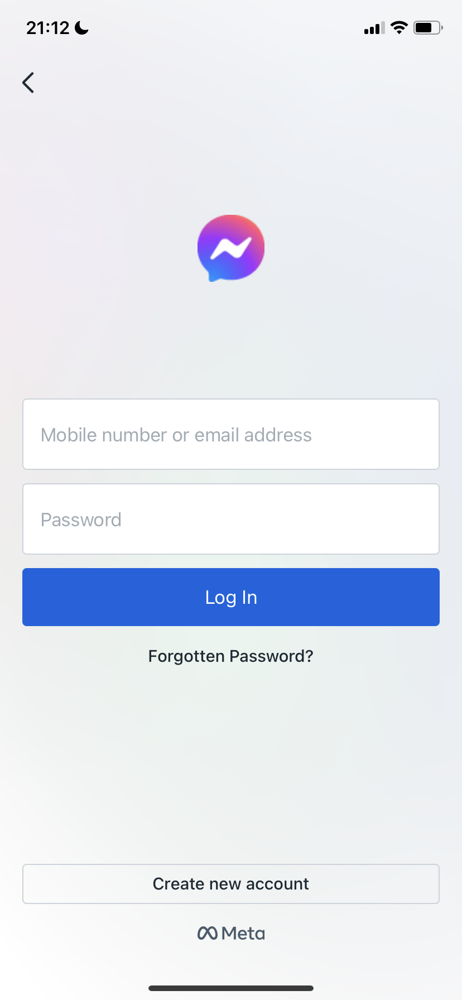         | 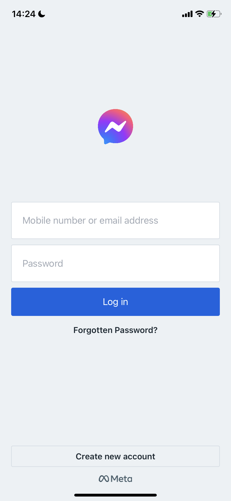         |
|     | 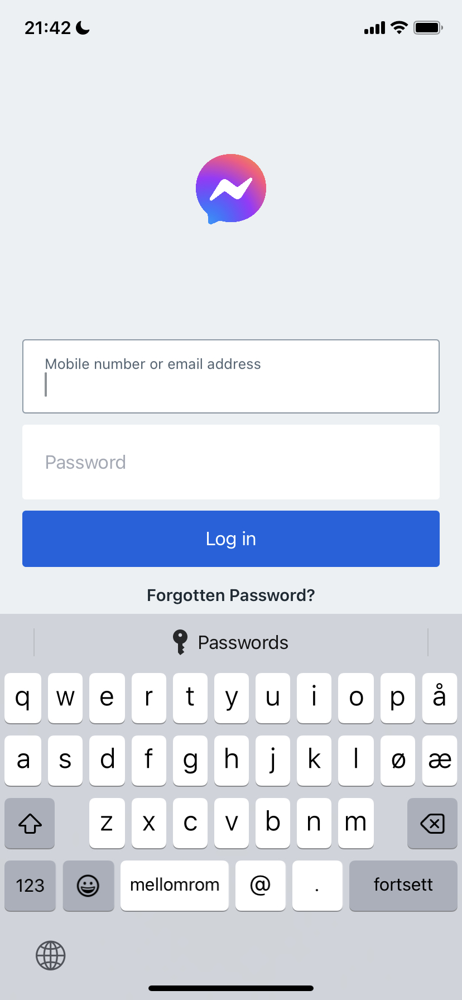    |
| 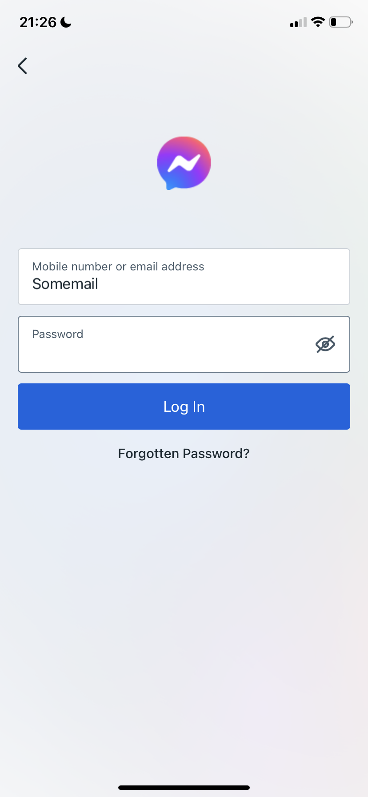 | 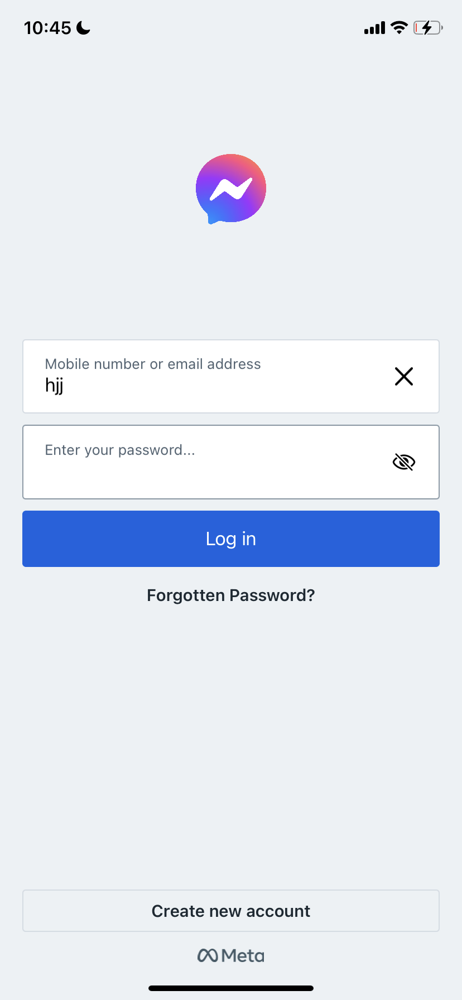 |
| 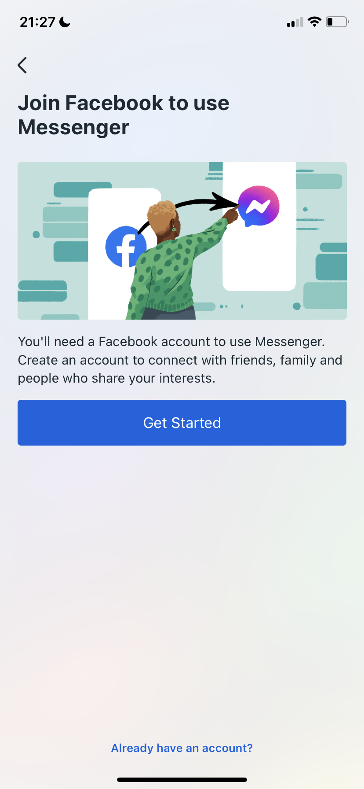      | 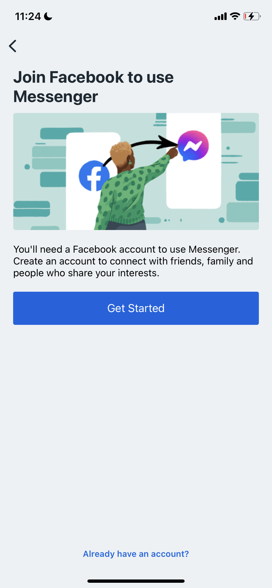      |
| 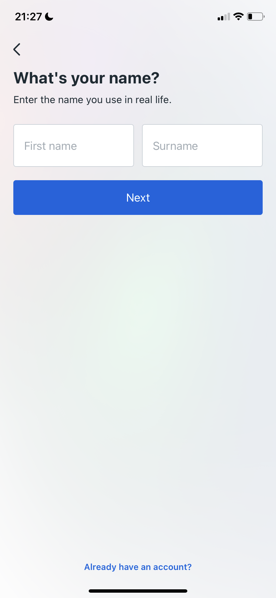           | 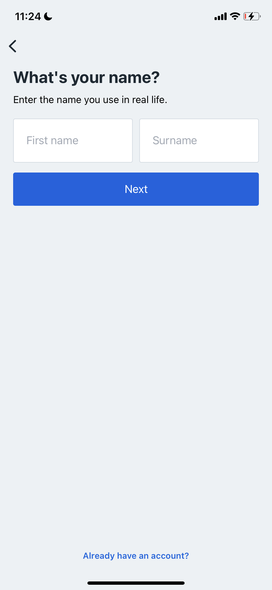           |
| 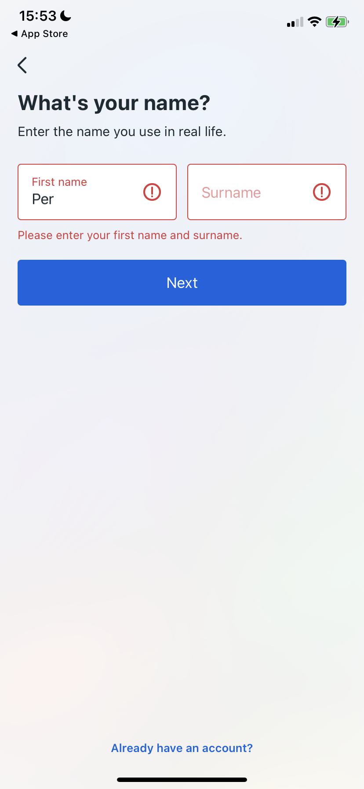      | 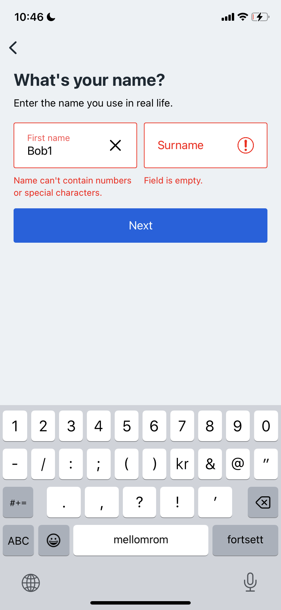      |
| 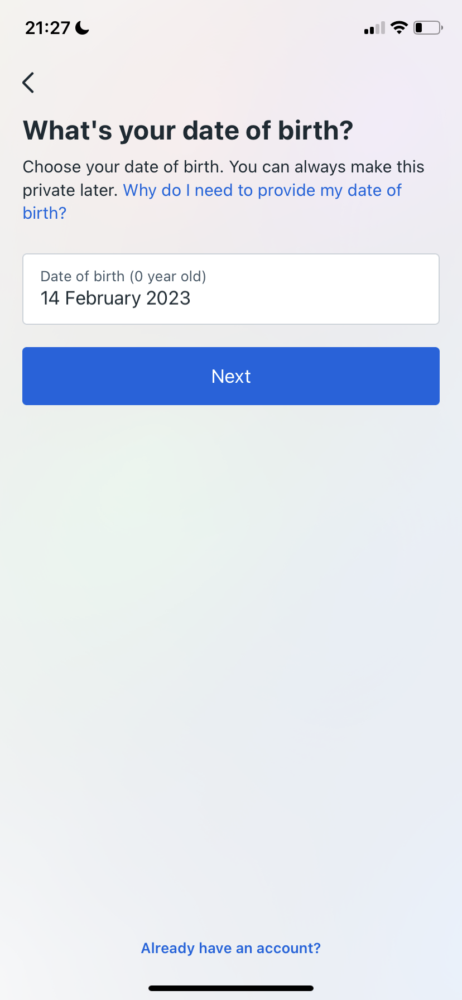       | 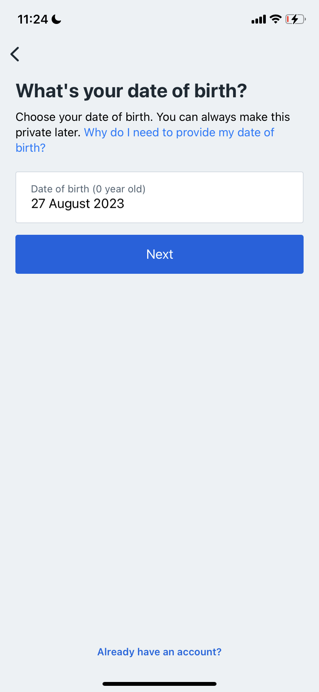       |
|   | 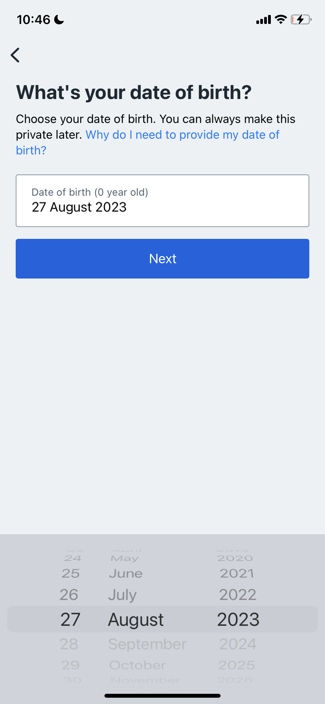  |
| 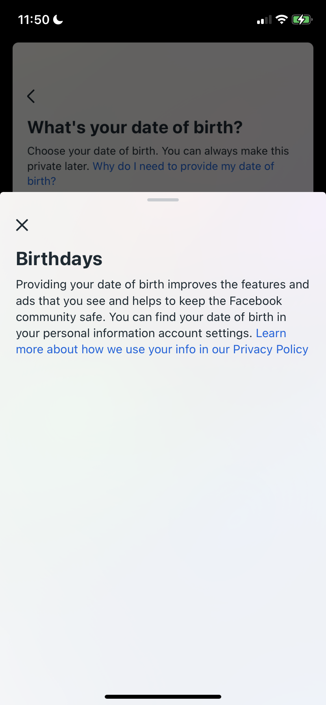  | 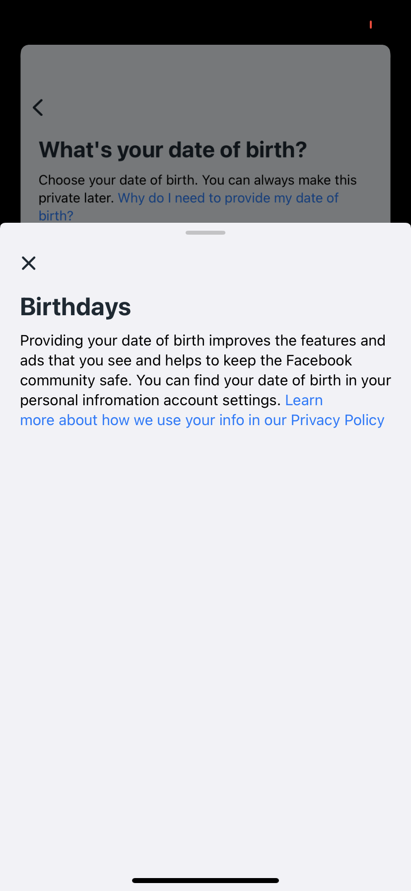  |
| 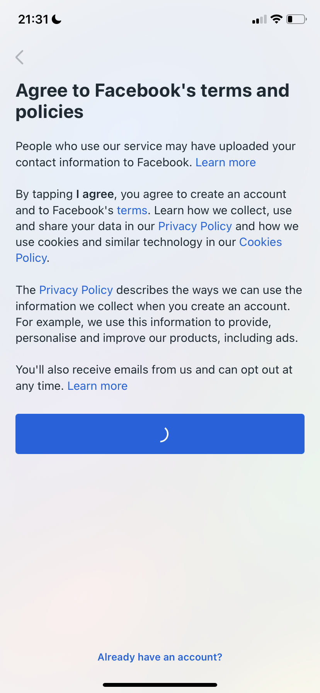          | 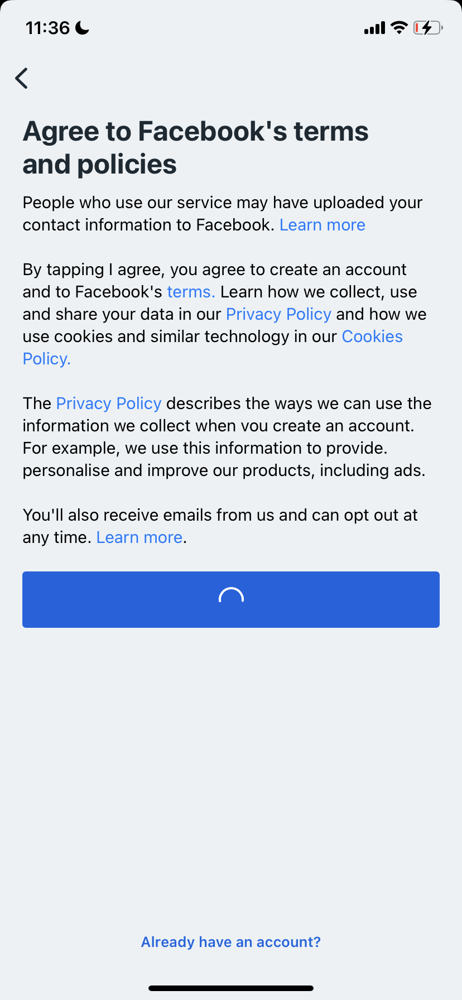          |

> **_NOTE:_**  The screenshots are from 2023, but Meta has updated their
> UI recently.


## Chat structure

```
// chatId is combined of userId + recipientId. 
// Will always be unique for the same two users in a one to one chat
// If group chat is supported, a unique id for the chatId 
// will suffice (it is not supported at the moment).


chatMessages
    |
    |----- chat_room_\(chatId)
                |
                |------ lastMessageId
                                |
                                |---- ChatMessage model

lastMessage // the content of the message in MessagesViewController (.value listener on chatId)
    |
    |----- chat_room_\(chatId)
                |
                |------ LastMessage model

userChats // the amount of chats (.childAdded on userId)
    |
    |----- userId
                |       
                |----- chat_room_\(chatId)
                |               |
                |               |----- chatRoomId: chatId
                |               |----- isMemeber: true
                |
                |------- chat_room_\(chatId) 
                
```

## What should be done

Here is a list of things I would do if I had more time. I may clone the repository in the future and implement them.

- [ ] Move all the UI into a separate repo, like [Finn](https://github.com/finn-no/FinniversKit). Why? The code is too long, and it is hard to test the components. There is also room for composition.
- [ ] Create a cloud function for creating an account. Why? A single operation for authenticating users and creating documents can’t be implemented through Firebase Auth and Firestore.
- [ ] Clean up the flows where users and chats are loaded simultaneously. Why? All the errors aren't properly handled, and there is some inconsistency.
- [ ] Add the option for group chats and update the components accordingly.

# Installation

1. Clone the repo
2. Create a new project in your Firebase console by clicking "Add project"
3. Create a Cloud Firestore database and RTDB database
4. Enable sign-in with email and password in Firebase Auth
5. Add the GoogleService-Info.plist to the project
6. Run the app

